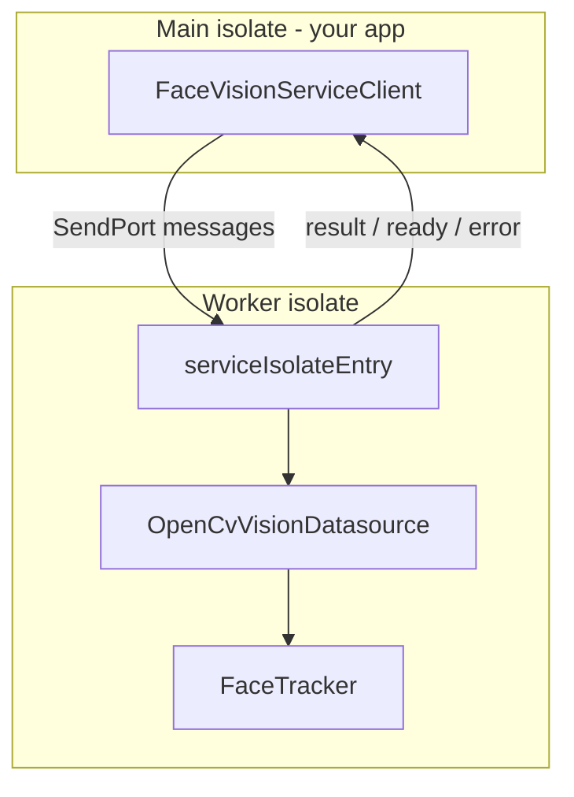

# face_vision_service

Portable Flutter package for face analysis: detection, age/gender classification, eye open/closed state, and **stable face IDs** across multiple images. All heavy OpenCV work runs in a **background isolate** so your app UI stays responsive.

Requires Flutter SDK — add as a dependency to your Flutter app.

## Features

- Face detection (YuNet, `FaceDetectorYN`)
- Age and gender classification (GoogleNet ONNX models)
- Per-eye state: `open`, `closed`, or `unknown` (Laplacian sharpness heuristic)
- **Stable `id` per face** within a session (IoU tracking between `analyze` calls)
- JPEG preview in each result (for UI display)
- Request/response isolate API: start once, analyze many images without reloading models
- **Live camera stream**: periodic auto-capture + analysis via `FaceVisionLiveSession`

## Requirements

### Flutter SDK

- Flutter SDK (package depends on `flutter` for bundled asset loading)
- SDK `^3.9.0`
- Dependency: `opencv_dart` 1.2.4 (native OpenCV must be available on the target platform)

### Bundled model files

Three pretrained ONNX models ship with the package under `lib/assets/models/` (~48 MB total). On first `start()`, they are loaded from package assets and copied to a temp cache directory so OpenCV can load them from disk. No asset or path configuration is needed in your app.

### Startup time and UI

`start()` is intentionally slow on first launch. Expect roughly:

| Phase | First launch | Later launches |
|-------|--------------|----------------|
| Copy ~48 MB models to cache | 3–20 s (skipped when cache exists) | Skipped |
| Spawn worker + load 3 DNN models | 10–60 s depending on device | Same each session |

**Always show a loading screen** while `await client.start()` runs. The UI may still feel sluggish on low-RAM devices during DNN load because CPU and memory spike system-wide — this is normal.

Use `onStartupProgress` to drive a progress indicator:

```dart
await client.start(
  onStartupProgress: (stage, progress) {
    // stage: 'spawning_isolate' | 'copying_models' | 'loading_dnn'
    // progress: 0.0–1.0 during copying_models, null otherwise
    print('$stage ${progress ?? ''}');
  },
);
```

Call `start()` once at app launch (not before every frame). Subsequent `analyze()` calls are fast.

| File | Role |
|------|------|
| `face_detection_yunet_2023mar.onnx` | YuNet face detector (~0.2 MB) |
| `age_googlenet.onnx` | Age classifier, GoogleNet (~24 MB) |
| `gender_googlenet.onnx` | Gender classifier, GoogleNet (~24 MB) |

Models are declared in the package `pubspec.yaml` and loaded automatically on `start()`.

## Installation

### Git dependency (recommended)

Add to your app's `pubspec.yaml`:

```yaml
dependencies:
  face_vision_service:
    git:
      url: https://github.com/mahmoud0saad/face_vision_service.git
      ref: v0.1.0
```

Then run:

```bash
flutter pub get
```

Pin `ref` to a tag (e.g. `v0.1.0`), a branch (e.g. `main`), or a commit SHA.

### Path dependency (local dev)

```yaml
dependencies:
  face_vision_service:
    path: D:/StudioProjects/StudioProjects/face_vision_service
```

Or a sibling folder relative to your app:

```yaml
dependencies:
  face_vision_service:
    path: ../face_vision_service
```

### Copy into your project

Copy this entire folder (including `lib/assets/models/`), add a `path:` dependency as above, and run `flutter pub get`.

## Quick start

```dart
import 'package:face_vision_service/face_vision_service.dart';

Future<void> run() async {
  final client = FaceVisionServiceClient();

  // 1) Start once — spawn isolate + load bundled models (slow)
  await client.start();

  // 2) Analyze images — fast, same isolate, no reload
  final result = await client.analyze(RawImage(
    bgrBytes: myBgrBuffer, // length = width * height * 3
    width: 640,
    height: 480,
  ));

  for (final face in result.faces) {
    print('#${face.id} ${face.genderLabel} ${face.ageLabel} '
        'eyes L:${face.leftEyeState} R:${face.rightEyeState}');
  }

  // 3) Optional: clear ID tracking (IDs restart from 1)
  await client.resetTracker();

  // 4) Stop when done — shutdown isolate
  await client.dispose();
}
```

### Recommended lifecycle

| Step | Call | Cost |
|------|------|------|
| Once at session start | `start()` | Slow (isolate + model load) |
| Per image | `analyze(rawImage)` | Fast |
| New identity session | `resetTracker()` | Instant |
| End session | `dispose()` | Releases isolate |

Do **not** call `start()` before every image — that reloads everything.

## Live camera stream

Use [`FaceVisionLiveSession`](lib/src/live/face_vision_live_session.dart) to open the camera, run internal confirmation sampling, and emit **confirmed** face results on a user-defined interval.

```dart
import 'package:face_vision_service/face_vision_service.dart';

Future<void> runLive() async {
  final session = FaceVisionLiveSession();

  await session.start(
    intervalSeconds: 3.0,
    confirmSamplingIntervalSeconds: 0.1,
    includePreviewJpeg: false, // skip JPEG encode for better performance
    onStartupProgress: (stage, progress) => print('$stage $progress'),
  );

  final subscription = session.results.listen(
    (result) {
      print('${result.faces.length} faces at ${result.width}x${result.height}');
      for (final face in result.faces) {
        print('#${face.id} ${face.genderLabel} ${face.ageLabel}');
      }
    },
    onError: (e, st) => print('Analysis error: $e'),
  );

  // ... run while needed ...

  await subscription.cancel();
  await session.stop(); // closes camera and results stream
  await session.dispose(); // also shuts down vision isolate
}
```

| Parameter | Description |
|-----------|-------------|
| `intervalSeconds` | How often **confirmed** results are emitted on `results` (minimum `0.5`) |
| `confirmSamplingIntervalSeconds` | Extra pause after each internal analyze completes (default `0.1`, minimum `0.0` for max throughput) |
| `deviceIndex` | Camera device index (default `0`) |
| `includePreviewJpeg` | When `false` (default for live), skips JPEG encoding in results |
| `onStartupProgress` | Same as `FaceVisionServiceClient.start()` |

**Behavior:**

- Internal sampling runs continuously between emissions to confirm gender and age (not limited to one image per `intervalSeconds`).
- Stream events fire every `intervalSeconds`; each event includes only faces where **both** gender and age are confirmed for that ID.
- If a face is not confirmed before an emission tick, it is **omitted** from that event (`faces` may be empty).
- Empty camera frames are skipped during internal sampling.
- Only one analyze runs at a time.
- Face IDs and locked labels stay stable across stream events within one session.
- To change intervals, call `stop()` then `start()` with new values.

**Internal check timing (typical):**

| Component | Typical range |
|-----------|----------------|
| Camera grab | ~20–50 ms |
| DNN pipeline (1 face) | ~50–250 ms |
| **Total per internal check** | **~80–300 ms** |

Effective gap between internal checks: `analyzeDuration + confirmSamplingIntervalSeconds`. Use `confirmSamplingIntervalSeconds: 0.0` for the fastest confirmation on capable hardware.

## Public API

Export entry: `package:face_vision_service/face_vision_service.dart`

### `FaceVisionServiceClient`

| Method / property | Description |
|-------------------|-------------|
| `bool isRunning` | `true` after `start`, until `dispose` |
| `Future<void> start({VisionDetectionConfig? detectionConfig, StartupProgressCallback? onStartupProgress})` | Spawn worker isolate and load bundled DNN models |
| `Future<FaceAnalysisResult> analyze(RawImage image, {bool includePreviewJpeg = true})` | Detect + classify one BGR frame |
| `Future<void> resetTracker()` | Clear face ID tracks (session reset) |
| `Future<void> dispose()` | Send shutdown, kill isolate |

### Input: `RawImage`

- `bgrBytes`: raw BGR pixels, row-major, `width * height * 3` bytes
- `width`, `height`: image dimensions in pixels

### Output: `FaceAnalysisResult`

| Field | Type | Description |
|-------|------|-------------|
| `width`, `height` | `int` | Input image size |
| `faces` | `List<DetectedFace>` | All detected faces |
| `previewJpeg` | `Uint8List?` | JPEG of the analyzed frame (quality 80); omitted when `includePreviewJpeg: false` |

### `FaceVisionLiveSession`

| Method / property | Description |
|-------------------|-------------|
| `Stream<FaceAnalysisResult> results` | Confirmed-face events on the emission interval (available after `start()`) |
| `bool isRunning` | `true` while camera capture loop is active |
| `FaceVisionServiceClient client` | Underlying vision client |
| `Future<void> start({required double intervalSeconds, double confirmSamplingIntervalSeconds, ...})` | Start vision service, open camera, begin internal sampling and periodic emission |
| `Future<void> stop()` | Stop capture, close camera, close results stream |
| `Future<void> dispose()` | `stop()` plus dispose vision client when session created it |

### `DetectedFace`

| Field | Type | Description |
|-------|------|-------------|
| `id` | `int` | Stable within tracker session (see below) |
| `x`, `y`, `width`, `height` | `int` | Bounding box in pixel coordinates |
| `genderLabel` | `String` | `"M"` or `"F"` when confirmed; `""` before confirmation |
| `ageLabel` | `String` | e.g. `"25-35"` when confirmed; `""` before confirmation |
| `detectionScore` | `double` | Face detector confidence |
| `leftEyeState`, `rightEyeState` | `String` | `"open"`, `"closed"`, or `"unknown"` |

### `FaceTracker` (exported, optional)

Pure-Dart tracker used inside the isolate. You normally do not instantiate it in the app; use `resetTracker()` on the client instead. Exported for testing or custom pipelines.

---

## How it works inside

### High-level architecture



1. **Main isolate** owns `FaceVisionServiceClient` and your UI / camera.
2. **Worker isolate** owns OpenCV `Net` objects, inference, and `FaceTracker` state.
3. Images and results cross the boundary as maps + `Uint8List` (no shared memory).

### Isolate protocol

Messages are `Map` with `cmd` (main → worker) or `type` (worker → main).

| Direction | Command / type | Payload | Meaning |
|-----------|----------------|---------|---------|
| → worker | `init` | `modelBytes` | Read bundled assets on main isolate, write to cache in worker, then load |
| → worker | `init` | — | Fallback: copy bundled models from package URI in worker, then load |
| ← main | `progress` | `stage`, `progress` | Startup progress (`copying_models`, `loading_dnn`) |
| ← main | `ready` | — | Models loaded |
| → worker | `analyze` | `bgrBytes`, `width`, `height`, `includePreviewJpeg` (optional, default `true`) | Run pipeline on one frame |
| ← main | `result` | `data` (FaceAnalysisResult map) | Success |
| → worker | `resetTracker` | — | Clear track list |
| ← main | `ok` | — | Tracker reset |
| → worker | `shutdown` | — | Exit isolate |
| ← main | `stopped` | — | Worker exited |
| ← main | `error` | `message` | Failure on init or analyze |

Handshake: worker sends its `SendPort` first; client then sends `init`.

### Analyze pipeline (per image)

Inside the worker ([`service_isolate_entry.dart`](lib/src/isolate/service_isolate_entry.dart)):

```
RawImage (BGR bytes)
    → cv.Mat
    → OpenCvVisionDatasource.detectAndClassify()
         → YuNet face detection (optional downscale to processMaxWidth)
         → per face: age/gender 224×224 blobs, eye Laplacian/EAR heuristic
    → FaceTracker.assign()  → stable ids
    → optional JPEG encode preview (when includePreviewJpeg is true)
    → FaceAnalysisResult → SendPort
```

### Vision stack ([`opencv_vision_datasource.dart`](lib/src/datasources/opencv_vision_datasource.dart))

| Step | Model / method |
|------|----------------|
| Detect faces | YuNet `FaceDetectorYN` (input size set per frame) |
| Age / gender | GoogleNet ONNX nets on 224×224 face crop, RGB input (BGR frame swapped via `swapRB`), mean (104, 117, 123) in R,G,B order |
| Age ranges | 8 Adience buckets remapped to custom ranges (`0-10 … 50-70`) via [`vision_constants.dart`](lib/src/vision_constants.dart) `kAgeCustomRanges` |
| Eyes | [`eye_state_analyzer.dart`](lib/src/datasources/eye_state_analyzer.dart) — ROI above face, Laplacian std-dev vs threshold |

Tunable constants live in [`vision_constants.dart`](lib/src/vision_constants.dart) (confidence threshold, max faces, eye threshold, etc.).

### Stable face IDs and label locking ([`face_tracker.dart`](lib/src/tracking/face_tracker.dart))

Tracker state lives **only in the worker isolate** for the lifetime of `start()` … `dispose()`.

1. Each detection gets a temporary box + attributes (`id = 0`).
2. `FaceTracker.assign()` matches boxes to previous tracks using **IoU** (default threshold `0.3`).
3. Matched face → **reuse** the same `id`.
4. Unmatched detection → new `id` (incrementing from 1).
5. Tracks missed for 15 consecutive analyzes are dropped (default `maxMissedFrames`).
6. `resetTracker()` clears all tracks; next IDs start at 1.

**Gender and age** lock independently after `kLabelConfirmFrames` (default `3`) consecutive agreeing analyze results for the same track. Until locked, `genderLabel` and `ageLabel` are `""` (never raw flipping values). After lock, labels stay fixed for that ID until `resetTracker()`.

Eye states (`leftEyeState`, `rightEyeState`) update every analyze.

Same person in a similar position across two `analyze` calls → same `id`. IDs are **not** persisted across `dispose()` or app restarts.

### Package layout

```
face_vision_service/
├── pubspec.yaml
├── README.md
└── lib/
    ├── assets/models/                # bundled OpenCV models
    ├── face_vision_service.dart      # public exports
    └── src/
        ├── bundled_models.dart
        ├── vision_constants.dart
        ├── entities/
        │   ├── model_paths.dart
        │   ├── raw_image.dart
        │   ├── detected_face.dart
        │   └── face_analysis_result.dart
        ├── datasources/
        │   ├── opencv_vision_datasource.dart
        │   └── eye_state_analyzer.dart
        ├── tracking/
        │   └── face_tracker.dart
        ├── live/
        │   └── face_vision_live_session.dart
        └── isolate/
            ├── service_client.dart       # main-isolate API
            └── service_isolate_entry.dart  # worker entry (top-level)
```

## Integration example (Flutter app)

The reference app [`face_vision`](../face_vision-master/) wraps this package:

- **Client**: [`lib/main.dart`](../face_vision-master/lib/main.dart) constructs `FaceVisionServiceClient()` and wires it through the repository layer
- **Adapter**: [`lib/data/repositories/face_analysis_repository_impl.dart`](../face_vision-master/lib/data/repositories/face_analysis_repository_impl.dart) maps service types to domain entities
- **Live capture**: camera stays open on the UI isolate; every 2s sends `RawImage` to `analyze()` while the service isolate keeps running

```dart
// App-side pattern (simplified)
await repository.startService();  // once
final frame = await camera.grab(); // repeated, camera already open
final detected = await repository.analyze(frame);
await repository.stopService();
```

## Limitations

- **One analyze at a time** per client instance (single `_analyzeCompleter`). Overlapping `analyze()` calls are not queued; wait for the previous future or skip ticks in your loop.
- **BGR only** input; no automatic RGBA/JPEG decode in the package.
- **Session-scoped IDs** only (IoU on boxes, not face embeddings).
- **Platform**: depends on `opencv_dart` native bindings (desktop/mobile support follows that package).
## License

MIT — see [LICENSE](LICENSE).
