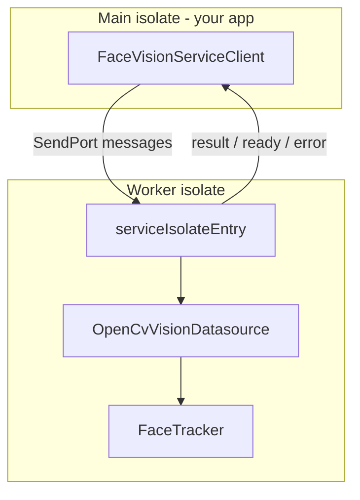

# face_vision_service

Portable Dart package for face analysis: detection, age/gender classification, eye open/closed state, and **stable face IDs** across multiple images. All heavy OpenCV work runs in a **background isolate** so your app UI stays responsive.

No Flutter dependency — copy this folder into any Dart/Flutter project.

## Features

- Face detection (OpenCV DNN SSD)
- Age and gender classification (Caffe models)
- Per-eye state: `open`, `closed`, or `unknown` (Laplacian sharpness heuristic)
- **Stable `id` per face** within a session (IoU tracking between `analyze` calls)
- JPEG preview in each result (for UI display)
- Request/response isolate API: start once, analyze many images without reloading models

## Requirements

### Dart SDK

- SDK `^3.9.0`
- Dependency: `opencv_dart` 1.2.4 (native OpenCV must be available on the target platform)

### Bundled model files

Six pretrained models ship with the package under `lib/assets/models/` (~94 MB total). On first `start()`, they are copied to a temp cache directory so OpenCV can load them from disk.

| File | Role |
|------|------|
| `opencv_face_detector_uint8.pb` | Face detection weights |
| `opencv_face_detector.pbtxt` | Face detection config |
| `age_net.caffemodel` | Age network |
| `age_deploy.prototxt` | Age deploy |
| `gender_net.caffemodel` | Gender network |
| `gender_deploy.prototxt` | Gender deploy |

Override with custom files via `start(ModelPaths(...))` if needed.

## Installation

### Git dependency (recommended)

Add to your app's `pubspec.yaml`:

```yaml
dependencies:
  face_vision_service:
    git:
      url: https://github.com/mahmoud0saad/face_vision_service.git
      ref: v0.1.0
```

Then run:

```bash
dart pub get
# or, in a Flutter project:
flutter pub get
```

Pin `ref` to a tag (e.g. `v0.1.0`), a branch (e.g. `main`), or a commit SHA.

### Path dependency (monorepo / local dev)

```yaml
dependencies:
  face_vision_service:
    path: packages/face_vision_service
```

### Copy into your project

Copy this entire folder (including `lib/assets/models/`), add a `path:` dependency as above, and run `dart pub get`.

## Quick start

```dart
import 'package:face_vision_service/face_vision_service.dart';

Future<void> run() async {
  final client = FaceVisionServiceClient();

  // 1) Start once — spawn isolate + load bundled models (slow)
  await client.start();

  // 2) Analyze images — fast, same isolate, no reload
  final result = await client.analyze(RawImage(
    bgrBytes: myBgrBuffer, // length = width * height * 3
    width: 640,
    height: 480,
  ));

  for (final face in result.faces) {
    print('#${face.id} ${face.genderLabel} ${face.ageLabel} '
        'eyes L:${face.leftEyeState} R:${face.rightEyeState}');
  }

  // 3) Optional: clear ID tracking (IDs restart from 1)
  await client.resetTracker();

  // 4) Stop when done — shutdown isolate
  await client.dispose();
}
```

### Recommended lifecycle

| Step | Call | Cost |
|------|------|------|
| Once at session start | `start()` | Slow (isolate + model load) |
| Per image | `analyze(rawImage)` | Fast |
| New identity session | `resetTracker()` | Instant |
| End session | `dispose()` | Releases isolate |

Do **not** call `start()` before every image — that reloads everything.

### Model loading in Flutter

Flutter assets are not files on disk. Pass a `readBytes` callback when constructing the client (see [Integration example](#integration-example-flutter-app)):

```dart
final client = FaceVisionServiceClient(
  readBytes: (relativePath) async {
    final data = await rootBundle.load('packages/face_vision_service/$relativePath');
    return data.buffer.asUint8List(data.offsetInBytes, data.lengthInBytes);
  },
);
await client.start();
```

Package assets under `lib/` are included automatically when you depend on `face_vision_service` — no extra `flutter: assets` entries in your app.

## Public API

Export entry: `package:face_vision_service/face_vision_service.dart`

### `FaceVisionServiceClient`

| Method / property | Description |
|-------------------|-------------|
| `bool isRunning` | `true` after `start`, until `dispose` |
| `Future<void> start([ModelPaths? paths])` | Spawn worker isolate and load DNNs (bundled models when `paths` is omitted) |
| `Future<FaceAnalysisResult> analyze(RawImage image)` | Detect + classify one BGR frame |
| `Future<void> resetTracker()` | Clear face ID tracks (session reset) |
| `Future<void> dispose()` | Send shutdown, kill isolate |

### Input: `RawImage`

- `bgrBytes`: raw BGR pixels, row-major, `width * height * 3` bytes
- `width`, `height`: image dimensions in pixels

### Output: `FaceAnalysisResult`

| Field | Type | Description |
|-------|------|-------------|
| `width`, `height` | `int` | Input image size |
| `faces` | `List<DetectedFace>` | All detected faces |
| `previewJpeg` | `Uint8List?` | JPEG of the analyzed frame (quality 80) |

### `DetectedFace`

| Field | Type | Description |
|-------|------|-------------|
| `id` | `int` | Stable within tracker session (see below) |
| `x`, `y`, `width`, `height` | `int` | Bounding box in pixel coordinates |
| `genderLabel` | `String` | `"M"` or `"F"` |
| `ageLabel` | `String` | e.g. `"(25-32)"` |
| `detectionScore` | `double` | Face detector confidence |
| `leftEyeState`, `rightEyeState` | `String` | `"open"`, `"closed"`, or `"unknown"` |

### `ModelPaths` and `BundledModels`

`ModelPaths` holds paths to the six model files on disk (used internally and for `start(customPaths)`). `BundledModels.loadToDisk()` copies package assets to a cache directory and returns `ModelPaths`.

### `FaceTracker` (exported, optional)

Pure-Dart tracker used inside the isolate. You normally do not instantiate it in the app; use `resetTracker()` on the client instead. Exported for testing or custom pipelines.

---

## How it works inside

### High-level architecture



1. **Main isolate** owns `FaceVisionServiceClient` and your UI / camera.
2. **Worker isolate** owns OpenCV `Net` objects, inference, and `FaceTracker` state.
3. Images and results cross the boundary as maps + `Uint8List` (no shared memory).

### Isolate protocol

Messages are `Map` with `cmd` (main → worker) or `type` (worker → main).

| Direction | Command / type | Payload | Meaning |
|-----------|----------------|---------|---------|
| → worker | `init` | `paths` | Load face/age/gender models |
| ← main | `ready` | — | Models loaded |
| → worker | `analyze` | `bgrBytes`, `width`, `height` | Run pipeline on one frame |
| ← main | `result` | `data` (FaceAnalysisResult map) | Success |
| → worker | `resetTracker` | — | Clear track list |
| ← main | `ok` | — | Tracker reset |
| → worker | `shutdown` | — | Exit isolate |
| ← main | `stopped` | — | Worker exited |
| ← main | `error` | `message` | Failure on init or analyze |

Handshake: worker sends its `SendPort` first; client then sends `init`.

### Analyze pipeline (per image)

Inside the worker ([`service_isolate_entry.dart`](lib/src/isolate/service_isolate_entry.dart)):

```
RawImage (BGR bytes)
    → cv.Mat
    → OpenCvVisionDatasource.detectAndClassify()
         → face SSD detection (optional downscale to max width 320)
         → per face: age/gender blobs, eye Laplacian heuristic
    → FaceTracker.assign()  → stable ids
    → JPEG encode preview
    → FaceAnalysisResult → SendPort
```

### Vision stack ([`opencv_vision_datasource.dart`](lib/src/datasources/opencv_vision_datasource.dart))

| Step | Model / method |
|------|----------------|
| Detect faces | TensorFlow SSD (`kFaceDetectWidth` × `kFaceDetectHeight` blob) |
| Age / gender | Caffe nets on 227×227 face crop |
| Eyes | [`eye_state_analyzer.dart`](lib/src/datasources/eye_state_analyzer.dart) — ROI above face, Laplacian std-dev vs threshold |

Tunable constants live in [`vision_constants.dart`](lib/src/vision_constants.dart) (confidence threshold, max faces, eye threshold, etc.).

### Stable face IDs ([`face_tracker.dart`](lib/src/tracking/face_tracker.dart))

Tracker state lives **only in the worker isolate** for the lifetime of `start()` … `dispose()`.

1. Each detection gets a temporary box + attributes (`id = 0`).
2. `FaceTracker.assign()` matches boxes to previous tracks using **IoU** (default threshold `0.3`).
3. Matched face → **reuse** the same `id`.
4. Unmatched detection → new `id` (incrementing from 1).
5. Tracks missed for 3 consecutive analyzes are dropped.
6. `resetTracker()` clears all tracks; next IDs start at 1.

Same person in a similar position across two `analyze` calls → same `id`. IDs are **not** persisted across `dispose()` or app restarts.

### Package layout

```
packages/face_vision_service/
├── pubspec.yaml
├── README.md
└── lib/
    ├── assets/models/                # bundled OpenCV models
    ├── face_vision_service.dart      # public exports
    └── src/
        ├── bundled_models.dart
        ├── vision_constants.dart
        ├── entities/
        │   ├── model_paths.dart
        │   ├── raw_image.dart
        │   ├── detected_face.dart
        │   └── face_analysis_result.dart
        ├── datasources/
        │   ├── opencv_vision_datasource.dart
        │   └── eye_state_analyzer.dart
        ├── tracking/
        │   └── face_tracker.dart
        └── isolate/
            ├── service_client.dart       # main-isolate API
            └── service_isolate_entry.dart  # worker entry (top-level)
```

## Integration example (Flutter app)

The reference app [`face_vision`](../../) wraps this package:

- **Models**: [`lib/data/datasources/model_loader.dart`](../../lib/data/datasources/model_loader.dart) supplies `readBytes` via `rootBundle`; `FaceVisionServiceClient.start()` loads bundled models
- **Adapter**: [`lib/data/repositories/face_analysis_repository_impl.dart`](../../lib/data/repositories/face_analysis_repository_impl.dart) maps service types to domain entities
- **Live capture**: camera stays open on the UI isolate; every 2s sends `RawImage` to `analyze()` while the service isolate keeps running

```dart
// App-side pattern (simplified)
await repository.startService();  // once
final frame = await camera.grab(); // repeated, camera already open
final detected = await repository.analyze(frame);
await repository.stopService();
```

## Limitations

- **One analyze at a time** per client instance (single `_analyzeCompleter`). Overlapping `analyze()` calls are not queued; wait for the previous future or skip ticks in your loop.
- **BGR only** input; no automatic RGBA/JPEG decode in the package.
- **Session-scoped IDs** only (IoU on boxes, not face embeddings).
- **Platform**: depends on `opencv_dart` native bindings (desktop/mobile support follows that package).
## License

MIT — see [LICENSE](LICENSE).
